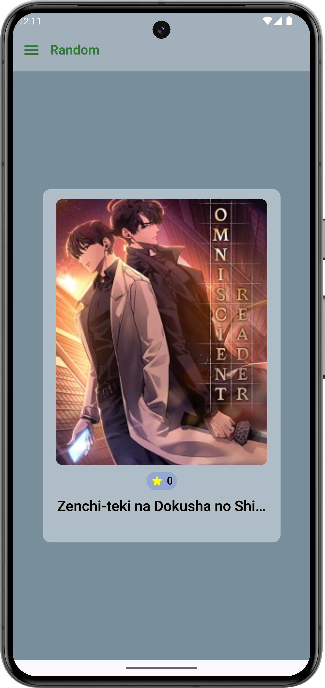
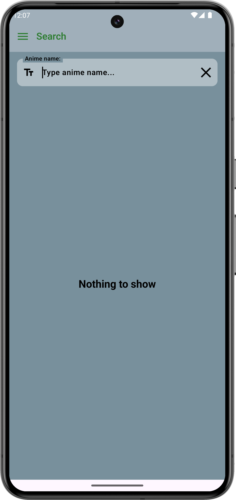
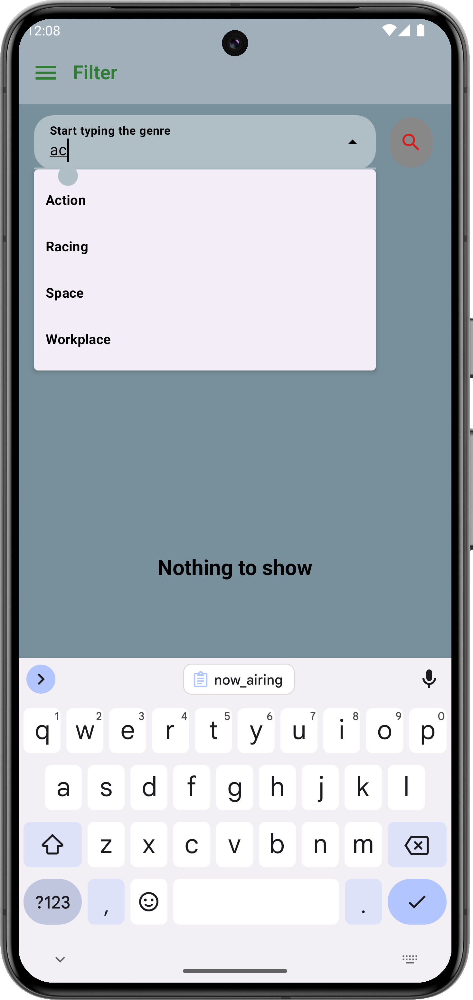
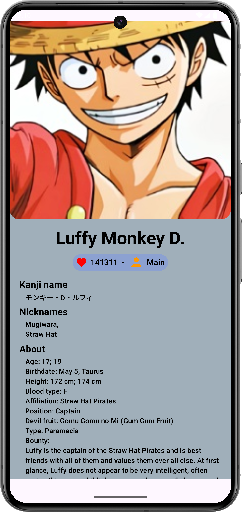
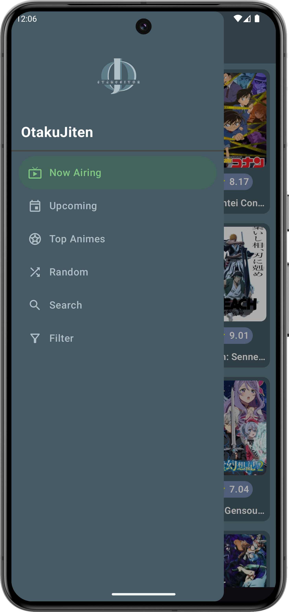

# OtakuJiten 📚

OtakuJiten es una enciclopedia de anime diseñada para otakus y fanáticos del anime que buscan información actualizada sobre sus animes favoritos. 
La aplicación incluye una variedad de funciones que permiten explorar animes en emisión, próximos lanzamientos, top animes, y mucho más.

## Características ✨

- **Now Airing**: Descubre los animes que actualmente están en emisión.
- **Upcoming**: Explora los próximos lanzamientos de anime.
- **Top Animes**: Navega por los animes mejor valorados.
- **Random Anime**: Obtén un anime aleatorio para descubrir nuevas series.
- **Search Anime**: Busca animes por su nombre.
- **Filter by Genre**: Filtra animes por género para encontrar contenido específico.

## Estructura de la Aplicación 🏗

La aplicación sigue una arquitectura limpia (Clean Architecture) dividiendo el proyecto en tres capas principales:

- **Data**: Contiene los repositorios, modelos de datos y lógica de acceso a los datos.
- **Domain**: Define los casos de uso de la aplicación.
- **UI**: Gestiona la presentación y experiencia de usuario. Dentro de esta capa, las pantallas están organizadas en `presentation -> features`, representando las diferentes funcionalidades.

## Tecnologías y Librerías Usadas 🛠

- **Retrofit**: Para la comunicación con la API de Jikan.
- **Moshi**: Para la serialización y deserialización de JSON.
- **Dagger/Hilt**: Inyección de dependencias para una gestión eficiente de instancias y ciclo de vida.
- **ViewModel**: Arquitectura MVVM con un ViewModel para cada pantalla.
- **Type Safe Navigation**: Navegación segura con tipos para una transición fluida entre pantallas.
- **Soporte de Tema Oscuro y Claro**: Interfaz adaptable a temas claro y oscuro.

## Capturas de Pantalla 📸

### Vista de cada pantalla de la aplicación:

| Now Airing                       | Upcoming                         | Top Animes                     |
|----------------------------------|----------------------------------|--------------------------------|
|  |  |  |

| Random Anime                     | Search Anime                    | Filter by Genre                |
|----------------------------------|---------------------------------|--------------------------------|
|  |  |  |

| Anime Info                       | Character Info                  |
|----------------------------------|---------------------------------|
|   |  |

| Navigation Drawer                |
|----------------------------------|
|  |
